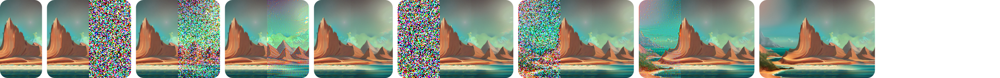
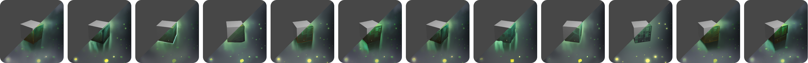
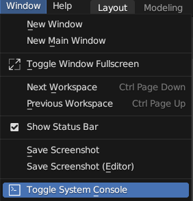

* Create textures, concept art, background assets, and more with a simple text prompt
* Use the 'Seamless' option to create textures that tile perfectly with no visible seam
* Texture entire scenes with 'Project Dream Texture' and depth to image
* Re-style animations with the Cycles render pass
* Run the models on your machine to iterate without slowdowns from a service

# Installation
Download the [latest release](https://github.com/carson-katri/dream-textures/releases/latest) and follow the instructions there to get up and running.

> On macOS, it is possible you will run into a quarantine issue with the dependencies. To work around this, run the following command in the app `Terminal`: `xattr -r -d com.apple.quarantine ~/Library/Application\ Support/Blender/3.3/scripts/addons/dream_textures/.python_dependencies`. This will allow the PyTorch `.dylib`s and `.so`s to load without having to manually allow each one in System Preferences.

If you want a visual guide to installation, see this video tutorial from Ashlee Martino-Tarr: https://youtu.be/kEcr8cNmqZk
> Ensure you always install the [latest version](https://github.com/carson-katri/dream-textures/releases/latest) of the add-on if any guides become out of date.

# Usage

Here's a few quick guides:

## [Setting Up](docs/SETUP.md)
Setup instructions for various platforms and configurations.

## [Image Generation](docs/IMAGE_GENERATION.md)
Create textures, concept art, and more with text prompts. Learn how to use the various configuration options to get exactly what you're looking for.

## [Texture Projection](docs/TEXTURE_PROJECTION.md)
Texture entire models and scenes with depth to image.

## [Inpaint/Outpaint](docs/INPAINT_OUTPAINT.md)
Inpaint to fix up images and convert existing textures into seamless ones automatically.

Outpaint to increase the size of an image by extending it in any direction.

## [Render Pass](docs/RENDER_PASS.md)
Perform style transfer and create novel animations with Stable Diffusion as a post processing step.

## [AI Upscaling](docs/AI_UPSCALING.md)
Upscale your low-res generations 4x.

## [History](docs/HISTORY.md)
Recall, export, and import history entries for later use.

# Compatibility
Dream Textures has been tested with CUDA and Apple Silicon GPUs. Over 4GB of VRAM is recommended.

If you have an issue with a supported GPU, please create an issue.

### Cloud Processing
If your hardware is unsupported, you can use DreamStudio to process in the cloud. Follow the instructions in the release notes to setup with DreamStudio.

# Contributing
For detailed instructions on installing from source, see the guide on [setting up a development environment](./docs/DEVELOPMENT_ENVIRONMENT.md).

# Troubleshooting

If you are experiencing trouble getting Dream Textures running, check Blender's system console (in the top left under the "Window" dropdown next to "File" and "Edit") for any error messages. Then [search in the issues list](https://github.com/carson-katri/dream-textures/issues?q=is%3Aissue) with your error message and symptoms.

> **Note** On macOS there is no option to open the system console. Instead, you can get logs by opening the app *Terminal*, entering the command `/Applications/Blender.app/Contents/MacOS/Blender` and pressing the Enter key. This will launch Blender and any error messages will show up in the Terminal app.

Features and feedback are also accepted on the issues page. If you have any issues that aren't listed, feel free to add them there!

The [Dream Textures Discord server](https://discord.gg/EmDJ8CaWZ7) also has a common issues list and strong community of helpful people, so feel free to come by for some help there as well.

