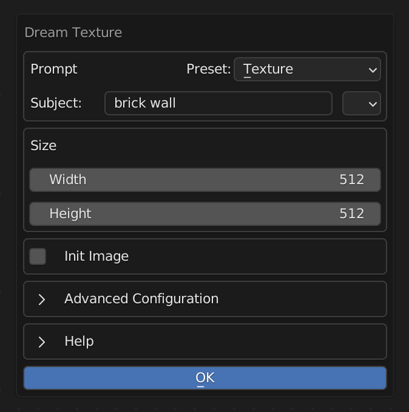
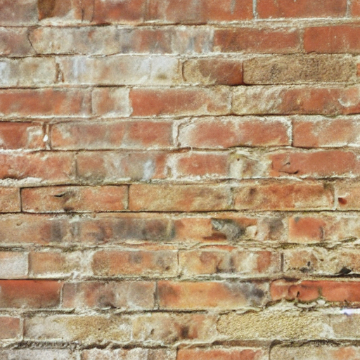
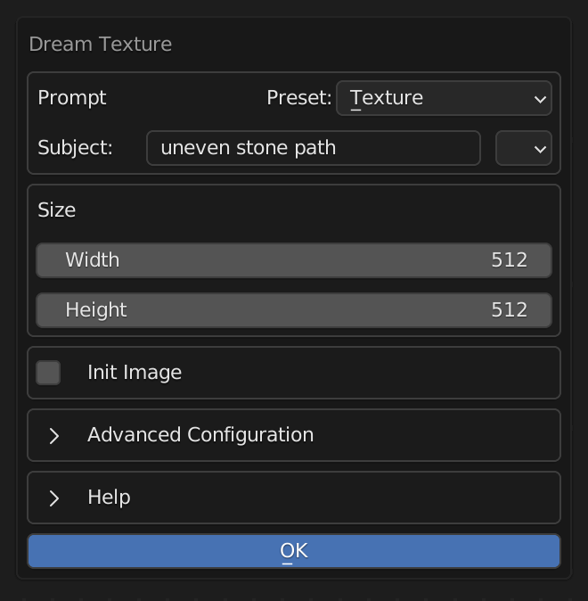
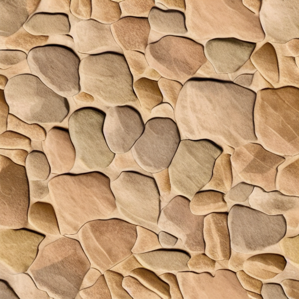
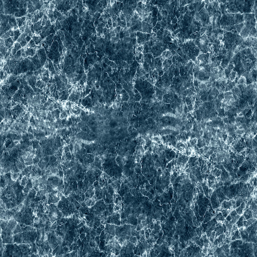
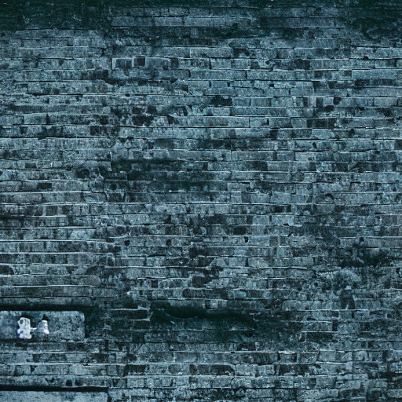
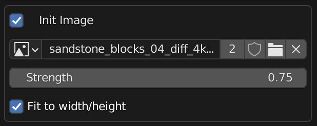
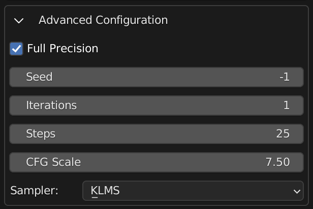

# Dream Textures

> Stable Diffusion built-in to the Blender shader editor.

* Create textures, concept art, background assets, and more with a simple text prompt
* Use the 'Seamless' option to create textures that tile perfectly with no visible seam
* Quickly create variations on an existing texture
* Experiment with AI image generation
* Run the models on your machine to iterate without slowdowns from a service

## Installation
Download the [latest release](https://github.com/carson-katri/dream-textures/releases/tag/0.0.6) and follow the instructions there to get up and running.

## Usage

| Enter a prompt | Generate a unique texture in a few seconds |
| -------------- | ------------------------------------------ |
|  |  |
|  |  |

| Take an existing texture | Modify it with a text prompt |
| ------------------------ | ---------------------------- |
|  |  |

Dream Textures provides most of the configuration options available when using Stable Diffusion directly.

1. Open the Shader or Image editor
2. Select the 'Dream Textures' tab in the side panel. You may need to press 'N' to open this panel.
3. Enter a prompt. There are some presets you can use to automatically fine tune your result:
    1. *Texture* - simply adds the word *texture* to the end of your prompt to help the model create a texture.
    2. *Photography* - provides many options for specifying a photorealistic result.
    3. *Concept Art* - create environments, characters, and more
    4. *Custom* - passes the prompt directly to SD with no additional keywords.
4. Click 'Generate'. The generation runs asynchronously, so Blender won't completely freeze up.
5. If you have an Image Editor open, the current progress of the model will appear there with the current step # as the image name (for example, *Step 1/25*).
6. After the image finishes generating, a new Image Texture node will be added to the open shader editor. The image is packed, so you may want to export it to a separate file.

> The name of the generated image is the random seed used to create it. If you want to use the same seed, copy the name of the image into the 'Seed' parameter under the 'Advanced' section.

## Init Image
Use an init image to create a variation of an existing texture.



1. Enable 'Init Image'
2. Select an image from your filesystem
> Currently, this doesn't work with packed textures. So select an image from your file system, or export the packed texture to a file and select that.
3. You can change the strength and specify if it should fit to the set size, or keep the original image size.
4. Enter a prompt that tells SD how to modify the image.
5. Click 'OK' and wait for it to finish.

## Advanced Configuration
These options match those of SD.



* *Full Precision* - more VRAM intensive, but creates better results. Disable this if you have a lower-end graphics card.
* *Seed* - a random seed if set to `-1`, otherwise it uses the value you input. You can copy the random seed from the generated image's name to use the same seed again.
* *Iterations* - how many images to generate. This doesn't quite work yet, so keep it at `1`.
* *Steps* - higher is generally better, but I wouldn't recommend going past 50 until you've refined your prompt.
* *CFG Scale* - essentially how much the model takes your prompt into consideration. `7.5` is a good default for a collaborative experience, but if you want to force the model to follow instructions crank it up to `15-20`.
* *Sampler* - KLMS is a good speed/quality default, DDIM is generally faster, and you'll get different results with each so play around with it.

## Compatibility
Dream Textures has been tested with CUDA and Apple Silicon GPUs.

If you have an issue with a supported GPU, please create an issue.

## Future Directions
* Other image map types (normal, roughness, displacement, etc.) using a new LDM checkpoint and vocabulary.
* AI upscaling and face fixing with ESRGAN and GFPGAN

## Contributing
After cloning the repository, there a few more steps you need to complete to setup your development environment:
1. Install submodules:
```sh
git submodule update --init --recursive
```
2. I recommend the [Blender Development](https://marketplace.visualstudio.com/items?itemName=JacquesLucke.blender-development) extension for VS Code.
3. After running the local add-on in Blender, setup the model weights like normal.
4. Install dependencies locally
    * Open Blender's preferences window
    * Enable *Interface* > *Display* > *Developer Extras*
    * Then install dependencies for development under *Add-ons* > *Dream Textures* > *Development Tools*
    * This will download all pip dependencies for the selected platform into `.python_dependencies`
