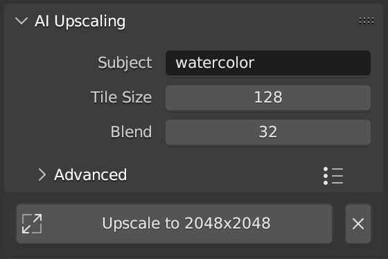

# AI Upscaling
Use the Stable Diffusion upscaler to increase images 4x in size while retaining detail. You can guide the upscaler with a text prompt.

> Upscaling uses the model `stabilityai/stable-diffusion-4x-upscaler`. This model will automatically be downloaded when the operator is first run.

Use the AI Upscaling panel to access this tool.

1. Open the image to upscale in an *Image Editor* space
2. Expand the *AI Upscaling* panel, located in the *Dream* sidebar tab
3. Type a prompt to subtly influence the generation.
4. Optionally configure the tile size, blend, and other advanced options.

The upscaled image will be opened in the *Image Editor*. The image will be named `Source Image Name (Upscaled)`.

## Tile Size
Due to the large VRAM consumption of the `stabilityai/stable-diffusion-4x-upscaler` model, the input image is split into tiles with each tile being upscaled independently, then stitched back together.

The default tile size is 128x128, which will result in an image of size 512x512. These 512x512 images are stitched back together to form the final image.

You can increase or decrease the tile size depending on your GPU's capabilities.

The *Blend* parameter controls how much overlap is included in the tiles to help reduce visible seams.