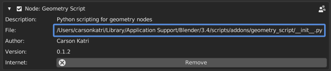
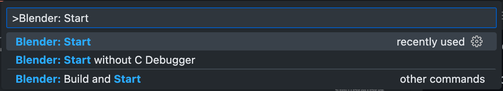
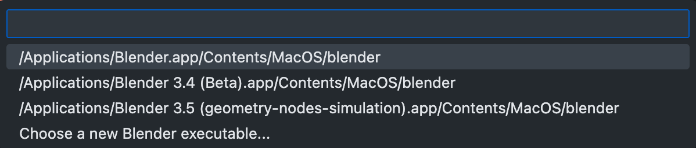
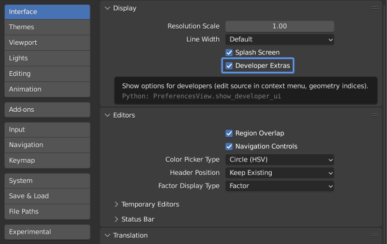
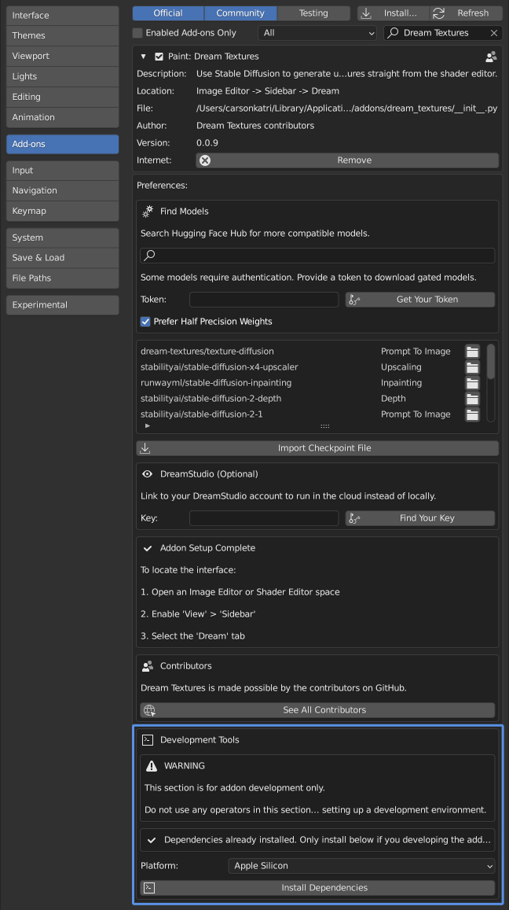

# Setting Up a Development Environment

With the following steps, you can start contributing to Dream Textures.

These steps can also be used to setup the add-on on Linux.

## Cloning

A basic knowledge of Git will be necessary to contribute. To start, clone the repository:

```sh
git clone https://github.com/carson-katri/dream-textures.git dream_textures
```

> If you use SSH, clone with `git clone git@github.com:carson-katri/dream-textures.git dream_textures`

This will clone the repository into the `dream_textures` folder.

## Installing to Blender

You can install the add-on to Blender in multiple ways. The easiest way is to copy the folder into the add-ons directory.

This directory is in different places on different systems.

* Windows
    * `%USERPROFILE%\AppData\Roaming\Blender Foundation\Blender\3.4\scripts\addons`
* macOS
    * `/Users/$USER/Library/Application Support/Blender/3.4/scripts/addons`
* Linux
    * `$HOME/.config/blender/3.4/scripts/addons`

> This path may be different depending on how you installed Blender. See [Blender's documentation](https://docs.blender.org/manual/en/latest/advanced/blender_directory_layout.html) for more information on the directory layout.

If you can't find the add-on folder, you can look at another third-party add-on you already have in Blender preferences and see where it is located.



### Using Visual Studio Code

> This is not necessary if you won't be making any changes to Dream Textures or prefer a different IDE.

You can also install and debug the add-on with the [Blender Development]() extension for Visual Studio Code.

Open the `dream_textures` folder in VS Code, open the command palette (Windows: <kbd>Shift</kbd> + <kbd>Ctrl</kbd> + <kbd>P</kbd>, macOS: <kbd>Shift</kbd> + <kbd>Command</kbd> + <kbd>P</kbd>), and search for the command `Blender: Start`.



Then choose which Blender installation to use.



Blender will now start up with the add-on installed. You can verify this by going to Blender's preferences and searching for *Dream Textures*.

## Installing Dependencies

When installing from source, the dependencies are not included. You can install them from Blender's preferences.

First, enable *Developer Extras* so Dream Textures' developer tools will be displayed.



Then, use the *Developer Tools* section to install the dependencies.



### Installing Dependencies Manually

In some cases, the *Install Dependencies* tool may not work. In this case, you can install the dependencies from the command line.

The best way to install dependencies is using the Python that ships with Blender. The command will differ depending on your operating system and Blender installation.

On some platforms, Blender does not come with `pip` pre-installed. You can use `ensurepip` to install it if necessary.

```sh
# Windows
"C:\Program Files\Blender Foundation\Blender 3.4\3.4\python\bin\python.exe" -m ensurepip

# macOS
/Applications/Blender.app/Contents/Resources/3.4/python/bin/python3.10 -m ensurepip

# Linux (via snap)
/snap/blender/3132/3.4/python/bin/python3.10 -m ensurepip
```

Once you have `pip`, the dependencies can be installed.

All of the packages *must* be installed to `dream_textures/.python_dependencies`. The following commands assume they are being run from inside the `dream_textures` folder.

```sh
# Windows
"C:\Program Files\Blender Foundation\Blender 3.4\3.4\python\bin\python.exe" -m pip install -r requirements/win-linux-cuda.txt --target .python_dependencies

# macOS
/Applications/Blender.app/Contents/Resources/3.4/python/bin/python3.10 -m pip install -r requirements/mac-mps-cpu.txt --target .python_dependencies

# Linux (via snap)
/snap/blender/3132/3.4/python/bin/python3.10 -m pip install -r requirements/win-linux-cuda.txt --target .python_dependencies
```

## Using the Add-on

Once you have the dependencies installed, the add-on will become fully usable. Continue setting up as described in the [setup guide](./SETUP.md).

## Common Issues

### macOS

1. On Apple Silicon, with the `requirements-dream-studio.txt` you may run into an error with gRPC using an incompatible binary. If so, please use the following command to install the correct gRPC version:
```sh
pip install --no-binary :all: grpcio --ignore-installed --target .python_dependencies --upgrade
```