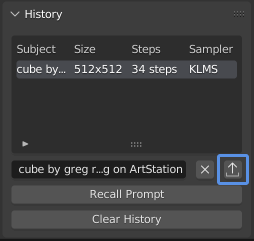

# History
Each time you generate, the full configuration is saved to the *History* panel. You can recall any previous generation to re-run it by clicking *Recall Prompt*.

## Prompt Import/Export
You can also export the selected prompt to JSON for later import. This is a more permanent way to backup prompts, and can be useful for sharing an exact image.

### Export
1. Select a history entry row
2. Click the export icon button
3. Save the JSON file to your computer

### Import
1. Select the import icon button in the header of the *Dream Texture* panel
2. Open a valid prompt JSON file
3. Every configuration option will be loaded in

