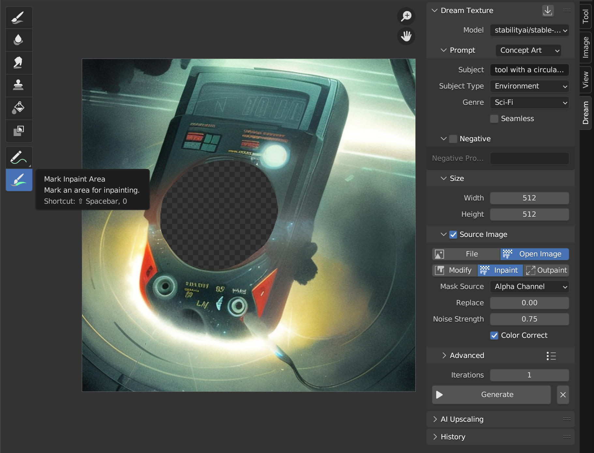
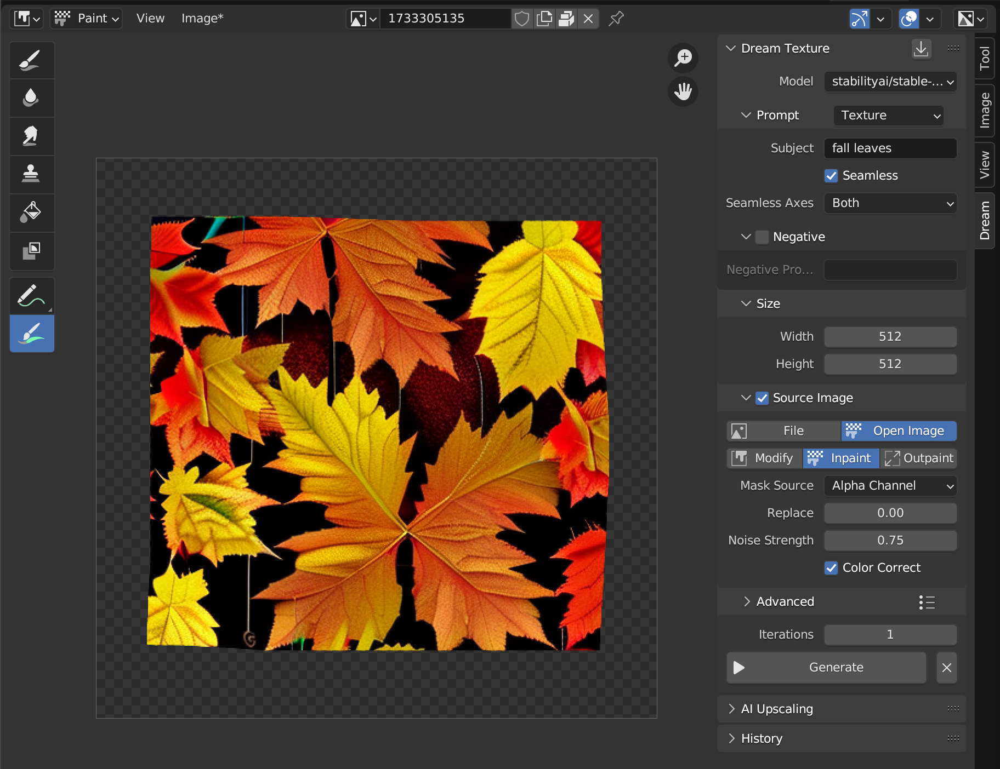
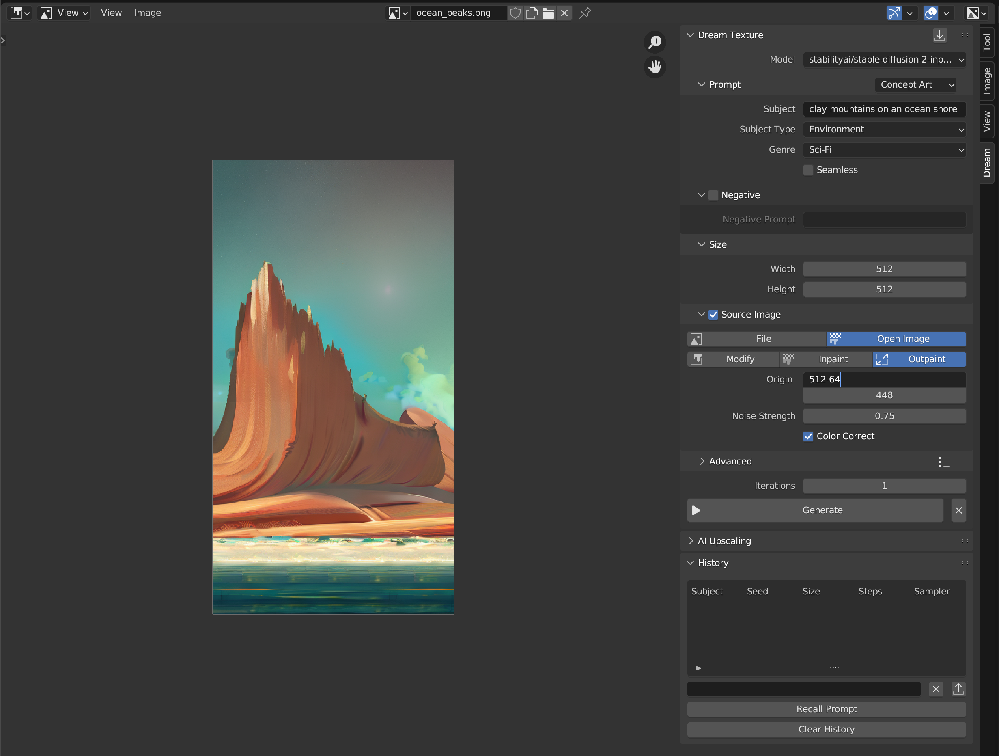
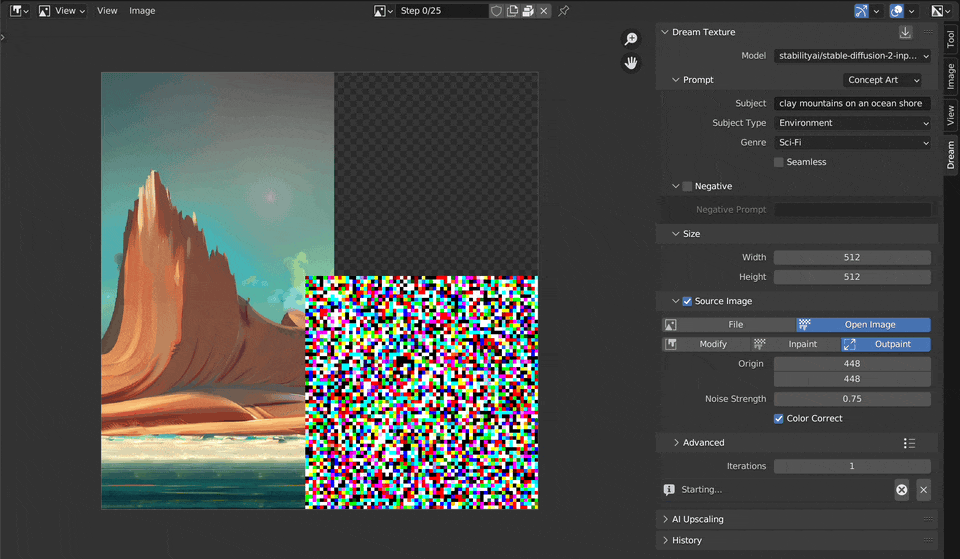

# Inpaint/Outpaint

This guide shows how to use both [inpainting](#inpainting) and [outpainting](#outpainting).

> For both inpainting and outpainting you *must* use a model fine-tuned for inpainting, such as `stabilityai/stable-diffusion-2-inpainting`. Follow the instructions to [download a model](setup.md#download-a-model).

# Inpainting
Inpainting refers to filling in or replacing parts of an image. It can also be used to [make existing textures seamless](#making-textures-seamless).

The quickest way to inpaint is with the *Mark Inpaint Area* brush.

1. Use the *Mark Inpaint Area* brush to remove the edges of the image
2. Enter a prompt for what should fill the erased area
3. Enable *Source Image*, select the *Open Image* source and the *Inpaint* action
4. Choose the *Alpha Channel* mask source
5. Click *Generate*

## Making Textures Seamless
Inpainting can also be used to make an existing texture seamless.

1. Use the *Mark Inpaint Area* brush to remove the edges of the image
2. Enter a prompt that describes the texture, and check *Seamless*
3. Enable *Source Image*, select the *Open Image* source and the *Inpaint* action
4. Click *Generate*

# Outpainting
Outpainting refers to extending an image beyond its original size. Use an inpainting model such as `stabilityai/stable-diffusion-2-inpainting` for outpainting as well.

1. Select an image to outpaint and open it in an Image Editor
2. Choose a size, this is how large the outpaint will be
3. Enable *Source Image*, select the *Open Image* source and the *Outpaint* action
4. Set the origin of the outpaint. See [Choosing an Origin](#choosing-an-origin) for more info.

### Choosing an Origin
The top left corner of the image is (0, 0), with the bottom right corner being the (width, height).

You should always include overlap or the outpaint will be completely unrelated to the original. The add-on will warn you if you do not include any.

Take the image below for example. We want to outpaint the bottom right side. Let's figure out the correct origin.

Here's what we know:
1. We know our image is 512x960. You can find this in the sidebar on the *Image* tab.
2. We set the size of the outpaint to 512x512 in the *Dream* tab

With this information we can calculate:
1. The X origin will be the width of the image minus some overlap. The width is 512px, and we want 64px of overlap. So the X origin will be set to `512 - 64` or `448`.
2. The Y origin will be the height of the image minus the height of the outpaint size. The height of the image is 960px, and the height of the outpaint is 512px. So the Y origin will be set to `960 - 512` or `448`.

> Tip: You can enter math expressions into any Blender input field.

After selecting this origin, we can outpaint the bottom right side.

Here are other values we could have used for other parts of the image:

* Bottom Left: `(-512 + 64, 512 - 64)` or `(-448, 448)`
* Top Right: `(512 - 64, 0)` or `(448, 0)`
* Top Left: `(-512 + 64, 0)` or `(-448, 0)`
* Top: `(0, 0)`
* Bottom: `(0, 512 - 64)` or `(0, 448)`