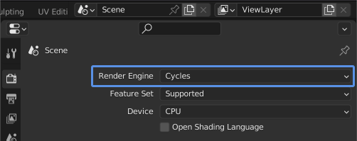
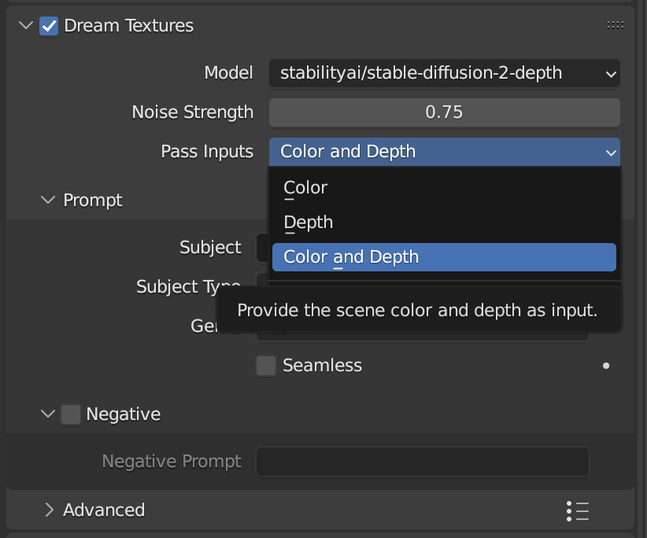
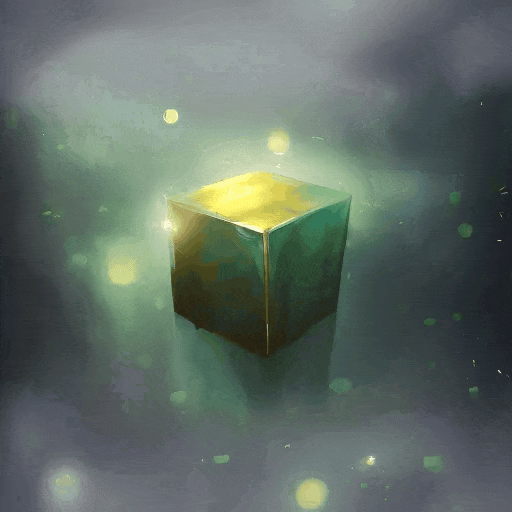

# Render Pass
A custom 'Dream Textures' render pass is available for Cycles. This allows you to run Dream Textures on the render result each time the scene is rendered. It works with animations as well, and can be used to perform style transfer on each frame of an animation.

> The render pass and Cycles will both use significant amounts of VRAM depending on the scene. You can use the CPU to render on Cycles to save resources for Dream Textures.

1. In the *Render Properties* panel, switch to the *Cycles* render engine

> In the *Output Properties* panel, ensure the image size is reasonable for your GPU and Stable Diffusion. 512x512 is a good place to start.

2. Enable the *Dream Textures* render pass, and enter a text prompt. You can also specify which pass inputs to use. Using depth information can help the rendered result match the scene geometry.

> When using depth, you *must* select a depth model, such as `stabilityai/stable-diffusion-2-depth`. Follow the instructions to [download a model](setup.md#download-a-model).

3. To use the Dream Textures generated image as the final result, open the *Compositor* space
4. Enable *Use Nodes*
5. Connect the *Dream Textures* socket from the *Render Layers* node to the *Image* socket of the *Composite* node

Now whenever you render your scene, it will automatically run through Stable Diffusion and output the result.
Here's an example using only the *Depth* pass as input.

## Controlling the Output

### Depth
Using a depth model and choosing *Pass Inputs* such as *Depth* or *Color and Depth* can go a long way in making the result closely match the geometry of your scene.

### Noise Strength
The noise strength parameter is very important when using this render pass. It is the same as *Noise Strength* described in [Image Generation](IMAGE_GENERATION.md#modify). If you want your scene composition, colors, etc. to be preserved, use a lower strength value. If you want Stable Diffusion to take more control, use a higher strength value.

This does not apply when using the *Depth* pass input and no color.

### Seed
Enabling *Random Seed* can give you some cool effects, and allow for more experimentation. However, if you are trying to do simple style transfer on an animation, using a consistent seed can help the animation be more coherent.

## Animation
You can animate most of the properties when using the render pass. Simply create keyframes as you typically would in Blender, and the properties will automatically be updated for each frame.