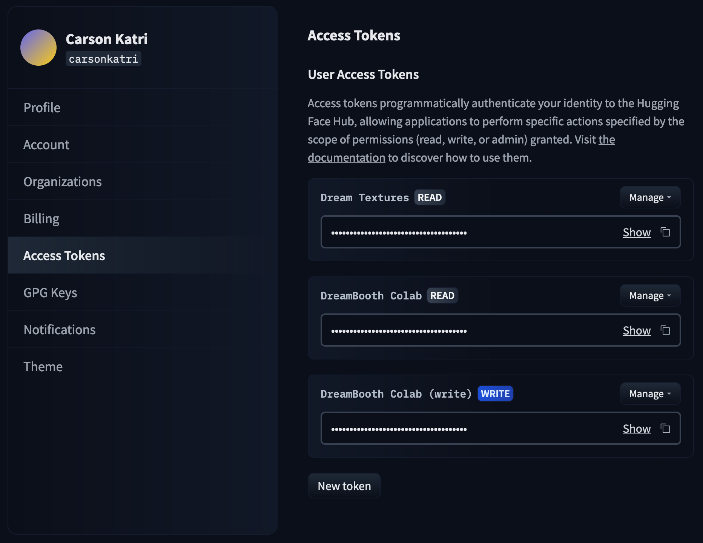
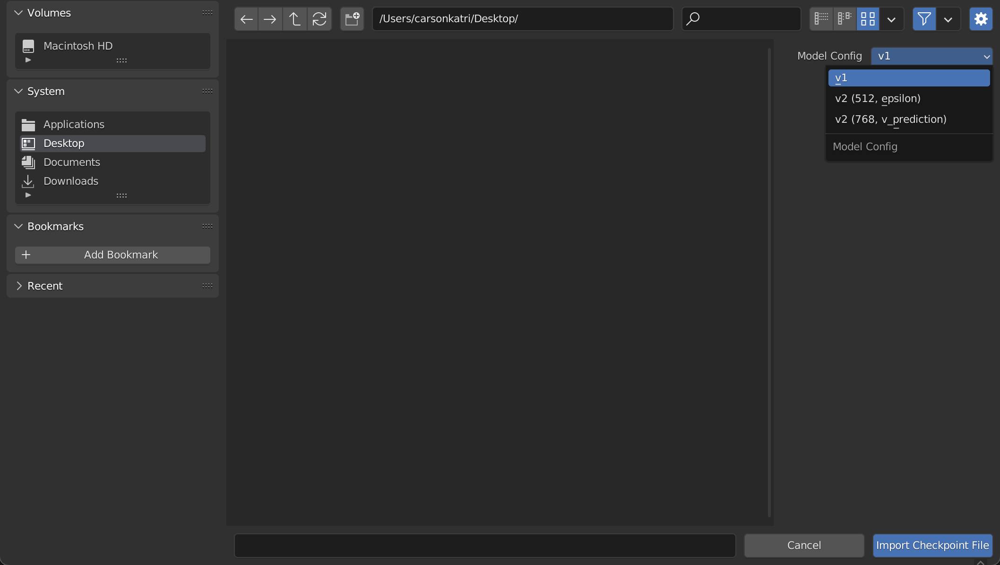
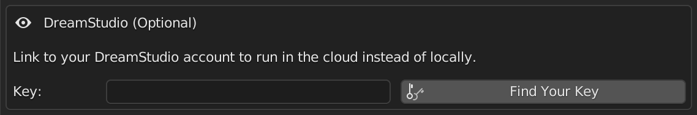
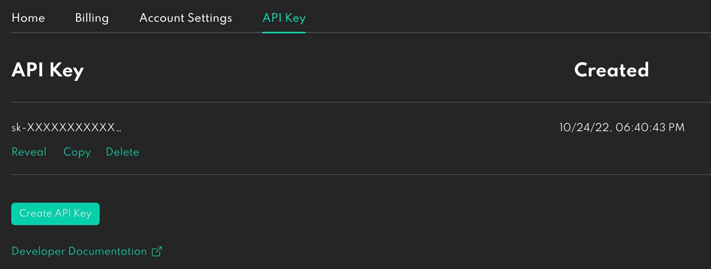

# Setting Up
Getting up and running is easy. Make sure you have several GBs of storage free, as the model weights and add-on consume a lot of storage space.

In general, all of the instructions you need to setup will be given within Blender. However, if you want to see screenshots and more explanation this can be helpful.

If you have any problems, you can get help in the [Dream Textures Discord server](https://discord.gg/EmDJ8CaWZ7).

## Installation

See the [release notes](https://github.com/carson-katri/dream-textures/releases/latest) for the most recent version of Dream Textures. There you will find a section titled "Choose Your Installation". Use the dropdowns to find the right version for your system.

> The add-on archive for Windows is compressed with 7-Zip to fit within GitHub's file size limits. Follow the instructions on the release notes page to extract the contained `.zip` file.

After you have the add-on installed in Blender, check the box in Blender preferences to enable it. Then follow the steps below to complete setup.

If you downloaded a DreamStudio-only version, you can skip to the [DreamStudio section](#dreamstudio).

> **DO NOT** try to install dependencies. Tools for doing so are intended for development. *Always* [download a prebuilt version](https://github.com/carson-katri/dream-textures/releases/latest).

## Download a Model
There are [hundreds of models](https://huggingface.co/sd-dreambooth-library) to choose from. A good model to start with is `stabilityai/stable-diffusion-2-1-base`. This is the latest 512x512 Stable Diffusion model.

In the add-on preferences, search for this model. Then click the download button on the right.

> Depending on your Internet speeds, it may take a few minutes to download.

### Other Useful Models
There are a few other models you may want to download as well:

* `stabilityai/stable-diffusion-2-inpainting` - Fine-tuned for inpainting, and required to use the [inpaint and outpaint](INPAINT_OUTPAINT.md) features
* `stabilityai/stable-diffusion-2-depth` - Uses depth information to guide generation, required for [texture projection](TEXTURE_PROJECTION.md), the [render pass](RENDER_PASS.md) when using depth pass input, and image to image when using depth
* `stabilityai/stable-diffusion-x4-upscaler` - Upscales the input image 4x, used only for [upscaling](AI_UPSCALING.md)
* `stabilityai/stable-diffusion-2-1` - Fine-tuned for 768x768 images

### Private Models
Some models are gated or private to your account/organization. To download these models, generate a Hugging Face Hub token and paste it in the "Token" field. You can generate a token in your [account settings on Hugging Face](https://huggingface.co/settings/tokens).

### Importing Checkpoints
Dream Textures can also import `.ckpt` files, which you may be familiar with if you've used [AUTOMATIC1111/stable-diffusion-webui](https://github.com/AUTOMATIC1111/stable-diffusion-webui).

Click *Import Checkpoint File* in add-on preferences, then select your checkpoint file. You should also specify what kind of model it is in the sidebar of the file picker.

If you don't see the sidebar, press *N* on your keyboard or click the gear icon in the top right.

Here's what the various *Model Config* options are for:

* `v1` - Weights from the original [CompVis/stable-diffusion](https://github.com/CompVis/stable-diffusion) code, such as `stable-diffusion-v1-x`
* `v2 (512, epsilon)` - Weights from the updated [Stability-AI/stablediffusion](https://github.com/Stability-AI/stablediffusion) code, specifically models with `prediction_type="epsilon"` such as the 512x512 models
* `v2 (768, v_prediction)` - Weights from the updated [Stability-AI/stablediffusion](https://github.com/Stability-AI/stablediffusion) code, specifically models with `prediction_type="v_prediction"` such as the 768x768 models

After choosing the file, the model will be converted to the Diffusers format automatically and be available in your model list.

## DreamStudio
To connect your DreamStudio account, enter your API key in the add-on preferences.

You can find your key in the [account settings page of DreamStudio](https://beta.dreamstudio.ai/membership?tab=apiKeys).

