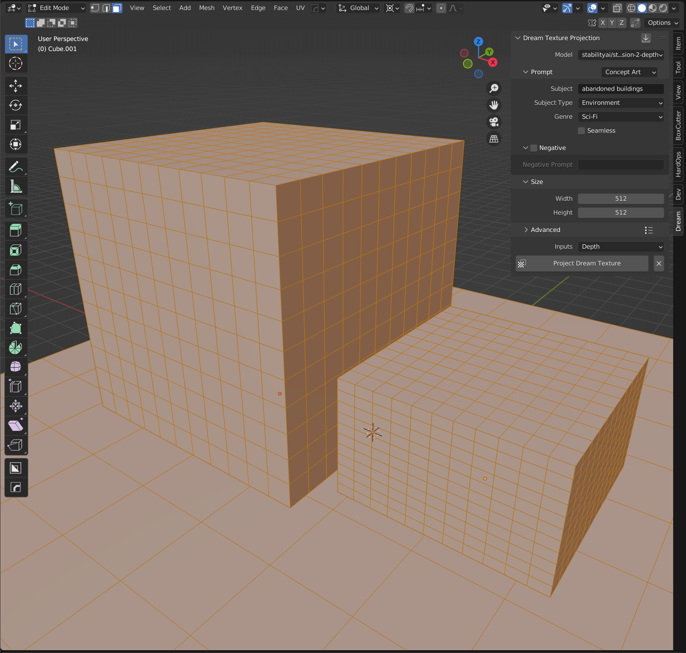

# Texture Projection

Using depth to image, Dream Textures is able to texture entire scenes automatically with a simple prompt.

It's sort of like [Ian Hubert's method](https://www.youtube.com/watch?v=v_ikG-u_6r0) in reverse. Instead of starting with an image and building geometry around that, we start with the geometry and generate an image that projects perfectly onto it.

> Make sure you download a depth model such as `stabilityai/stable-diffusion-2-depth`. Follow the instructions to [download a model](SETUP.md#download-a-model).

Follow the steps below to project a texture onto your mesh.

## Selecting a Target
In the 3D Viewport, select the objects you want to project onto. Then in edit mode, select all of the faces to target. Only the selected faces will be given the new texture.

Every object in the viewport will be factored into the depth map. To only use the selected objects in the depth map, enter local view by pressing */* or selecting *View* > *Local View* > *Toggle Local View* in the viewport menu bar.

> Tip: Large unbroken faces do not always project well. Try subdividing your mesh if the projection is warping.

## Prompting

In the sidebar, select the "Dream" panel. Choose a depth model from the dropdown, and enter a prompt. All of the options available for image generation are available here as well.

At the bottom you can choose what data to use for the projection. The default is "Depth". You can switch to "Depth and Color" to factor in the current color from the viewport.

> The color data is retrieved from the current viewport. Switch to *Viewport Shading* or *Rendered* view to use the colors specified for EEVEE or Cycles.

You can also adjust the size of the image from the default 512x512. Note that the depth data is in the same aspect ratio as the 3D Viewport window. If you have the Blender window landscape, you may want to adjust the size to be 768x512 or something similar. You could also shrink your window to make it square.

## Project Dream Texture
After configuring everything, click the *Project Dream Texture* button. This will begin the depth to image process.
You are free to move the viewport around as it generates. Switch to *Viewport Shading* mode to see each step as it generates live.

A new material will be added named with the seed of the generated image. The UVs for each selected face are also updated to be projected from the angle the material was generated at.

> Tip: In the sidebar under *View* you can adjust the *Focal Length* of the viewport.

